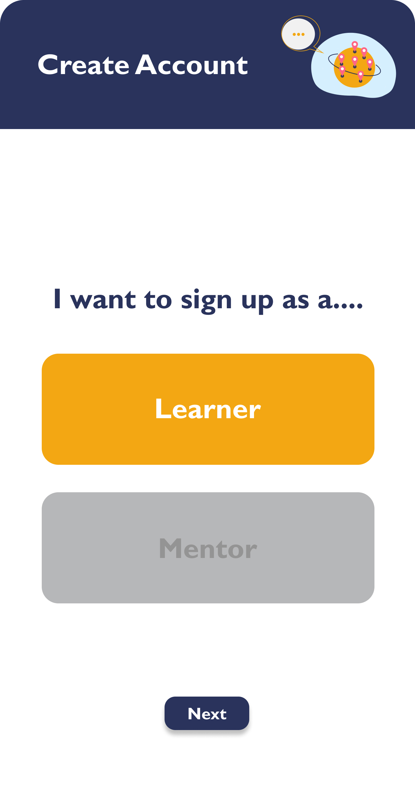
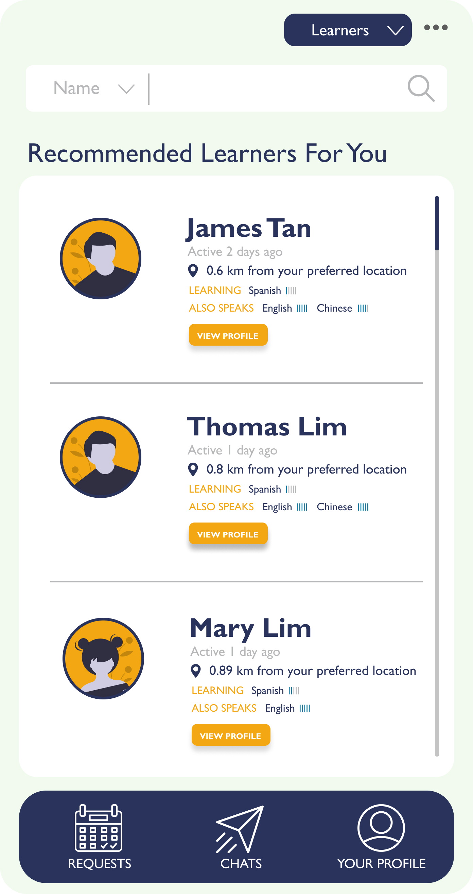
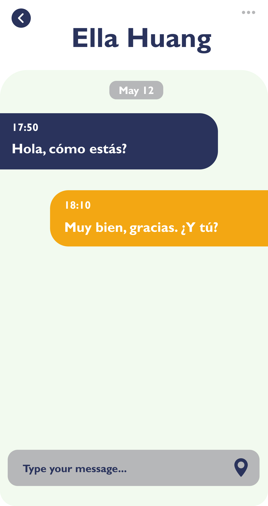

# helloworld!<>

helloworld!<> is a cross-platform mobile app created with Flutter, Dart, MySQL
and MongoDB. It provides a platform to connect all language learners and tutors
all around the world. 

## Table of Contents

* 
* 
* 
* 
    * 
    * 
    * 
    * 
    * 

# Motivation

Our team has seen similar applications that aims to provide language learners
a platform to be able to source credible tutors, like Italki. 

However, when we look into the forum, we see that there are a lot of users who 
are looking for other users to practice speaking in the language they are
trying to master. Looking for someone with the same language goals that can
communicate in a comfortable language is not easy. Several users even included 
video conference links like Skype to hopefully meet up with someone online to 
practice the language together.

Thus, our team hopes to provide a more integrative and seamless experience to
many users who are looking for such alternatives, that is we wish to provide
a platform where users can  

# Technologies

Our team decided to use Flutter mainly due to its cross-platform compatibility 
for both IOS and Android, as well as its great tooling and high performance. 
We also aim to leave our options open for web development by capitalizing on
Flutter's web compatibility. 

Naturally, we use Dart, which is the language Flutter is based in, to handle
the business logic and orchestrate the backend component.

We chose not to use Firebase as we value scalability and customizability.
Despite being a convenient solution, we want our app to remain flexible and
migration-friendly. So we decided to go with MySQL for user information and
MongoDB to store messages and conversations at scale. 

# Setup

1. Download [Fluter SDK](https://flutter.dev/docs/get-started/install) from the
   official website.

2. Clone into this repository.
```
$ git clone https://github.com/Aaronsms78/HelloWorld.git
```

3. Fetch dependencies specified in the pubspec.yaml file. 
```
$ flutter pub get
```

4. (Optional) Download [MongoDB](https://www.mongodb.com/download-center/community) 
   or/and [MySQL](https://dev.mysql.com/downloads/) to test on your local
   machine.

5. You're good to go!

# Features
## Create an account

Sign-up as either a learner or a mentor hassle-free!

<p>



</p>

## Hire a mentor

Choose from our qualified pool of mentors to suit your learning needs and
preferences.


## View user profile

Check out other language learners' profile and learning progress.




## Connect with others

Find someone with similar learning goals to practice speaking with.

<p>



</p>

## Schedule a meeting

Arrange a meeting with a language learner near your location and practice
speaking in a safe environment. 

<p>


</p>

<!--
## Meetup online to practice speaking (KIV)

Use our platform to randomly pair up with other language learner who is just as
committed as you to practice speaking and accelerate your learning progress!
-->

